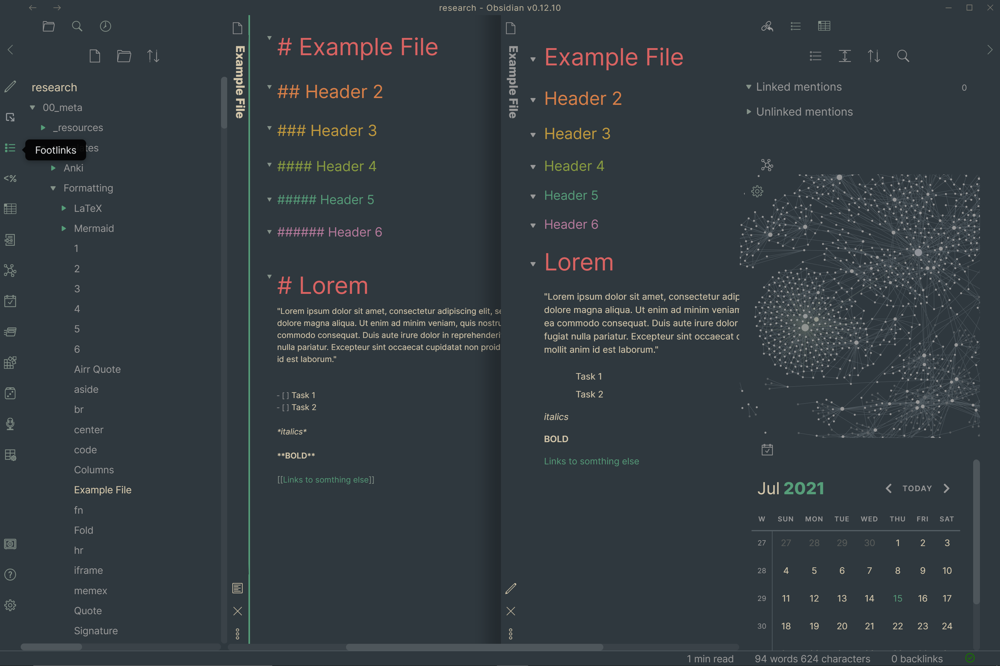
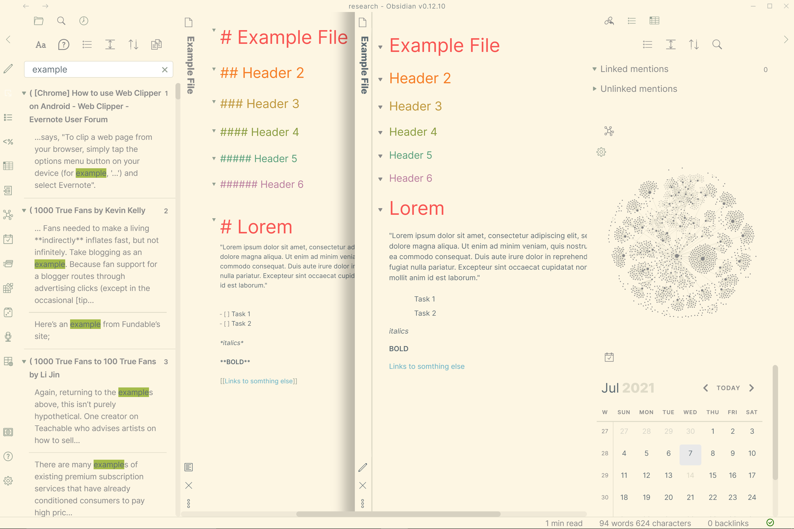

# Obsidian + Everforest

This is an [Everforest](https://github.com/sainnhe/everforest-vscode) theme for
[Obsidian](https://obsidian.md). It supports both light and dark modes.

> Everforest is a green based color scheme, it's designed to be warm and soft in order to protect developers' eyes.

## Features

- Green based but warm-toned.
- Designed to have soft contrast for eye protection.
- Works well with [redshift](https://github.com/jonls/redshift) and [f.lux](https://justgetflux.com).
- Customizable.
- Rich support for common file types.
- Semantic highlighting support.
- Italic support.

**Currently only supports the Medium Material modes.**
## Installation
Simply copy the `everforest.css` file to your vault directory/.obsidian/themes to choose it from your settings.

TODO:
- Fix syntax highlighting in code blocks.
- Create light/dark Hard Flat scheme.
- Create light/dark Soft Contrast scheme.

## Contributing
- This repo uses the "main" branch instead of "master"(legacy) branch.
- Fork this repo, detail changes, and submit a pull request.

