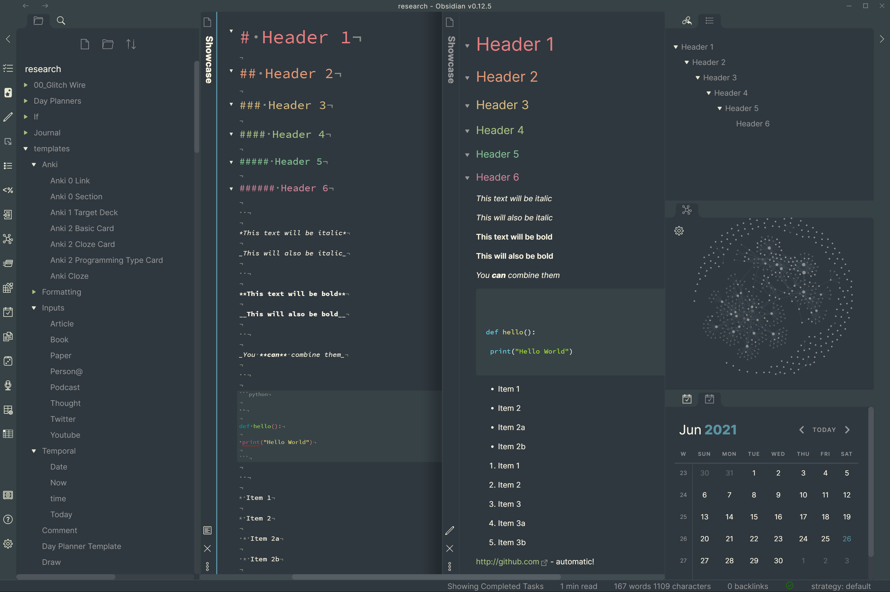
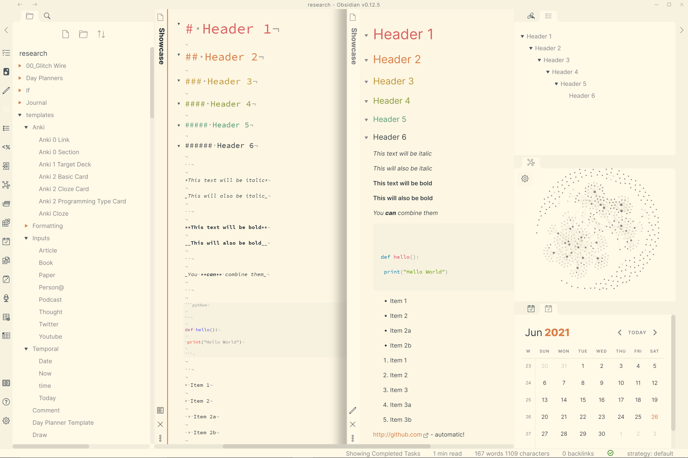

# Obsidian + Everforest

This is an [Everforest](https://github.com/sainnhe/everforest) theme for
[Obsidian](https://obsidian.md). It supports both light and dark modes.

Simply copy the `everforest.css` file to your vault directory/.obsidian/themes to choose it from your settings.

